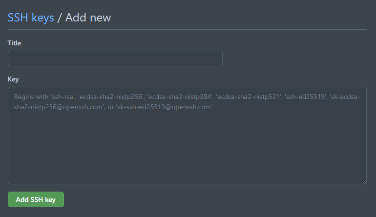

# Git Cheatsheet

This a all in one git cheatsheet. From installation to uploading your project into GitHub all common commands are listed here.


## Table of Content

1. [Connecting Git and GitHub with SSH](#ssh)
2. [Understanding Git](#git)
2. [Creating local git repository](#local)


<a name="ssh"></a>

### Connecting Git and GitHub with SSH

+ Install OpenSSH Client & OpenSSH Server.
+ Generate SSH key.
+ Copy ssh key from C:\Users\Username\.ssh\id_rsa.pub.
+ Paste it into your GitHub account and give it a title.


>To generate ssh key :

```
ssh-keygen
```
<br>




<br>
<a name="git"></a>

### Understanding Git

<br>

> to check git version

    git --version


<br>
<a name="local"></a>

### Creating local git repository

<br>

> To initialize empty git repository :
    
    git init


<br>

> To add files for tracking :

    git add .

###### tracked - a file which has been previously staged or committed;
###### untracked - a file which has not been staged or committed; or

<br>

> To record the changes :

    git commit -m "message"

<br>

### To see various information

<br>

> To see changes and tracking info :

    git status

###### git status lets you see which changes have been staged, which haven't, and which files aren't being tracked by Git.

<br>

> To see the changes :

    git diff

###### Diff command is used in git to track the difference between the changes made on a file

<br>

> To see info of previous commits :

    git log

###### The Git Log tool allows you to view information about previous commits that have occurred in a projec

<br>

> To see summary of previous commits (Heads) :

    git reflog


<br>

> To see specific commits :

    git show commitid


<br>

<br>

### Back and forth of commits

<br>

> To get back to any previous commit :

    git checkout commitid


<br>


> To get back to last commits :

    git checkout master/main


<br>

### Back and forth of specific file of commits

<br>

> To get back to any specific file of previous commit :

    git checkout commitid filename

<br>

> To get back to any specific file of last commit :

    git checkout master/main -f


<br>

### Resetting Commits

<br>

> remove and back to specific commit :

    git reset --hard commitid

###### Never reset after pushing commits

<br>

> accidental remove :

    git reset HEAD@{number}
    git reset --hard

<br>

> Amend to previous commit :

    git commit --adend


<br>

### Git Stash (temporary save) and Clean

<br>

> Git stash (clean pwd) :

    git stash

###### git stash when you want to record the current state of the working directory and the index, but want to go back to a clean working directory

<br>

> Return to Git stash :

    git stash pop/apply

<br>

> Return to specific Git stash :

    git stash pop/apply stash@{number}

<br>

> See stash list :

    git stash list

<br>

> Delete all stash :

    git stash clear

<br>

> Delete all untracked files :

    git clean -f -n
    git clean -f

<br>

### Git push clone

<br>

> Cloning git repo from web :

    git clone url

<br>

> Adding remote :

    git remote add origin(any name) url

<br>


> See all remote list :

    git remote show

<br>


> See remote url :

    git remote show origin(any name)

<br>


> Uploading into github :

    git push origin(any name) master(branch name)

<br>

> Pull from github :

    git pull origin(any name) master(branch name)

<br>

### git ignore file

<br>

> Creating .gitignore file :


<br>


### git merge

<br>

> mergin other branch to current branch :

    git merge (other branch name)

<br>
