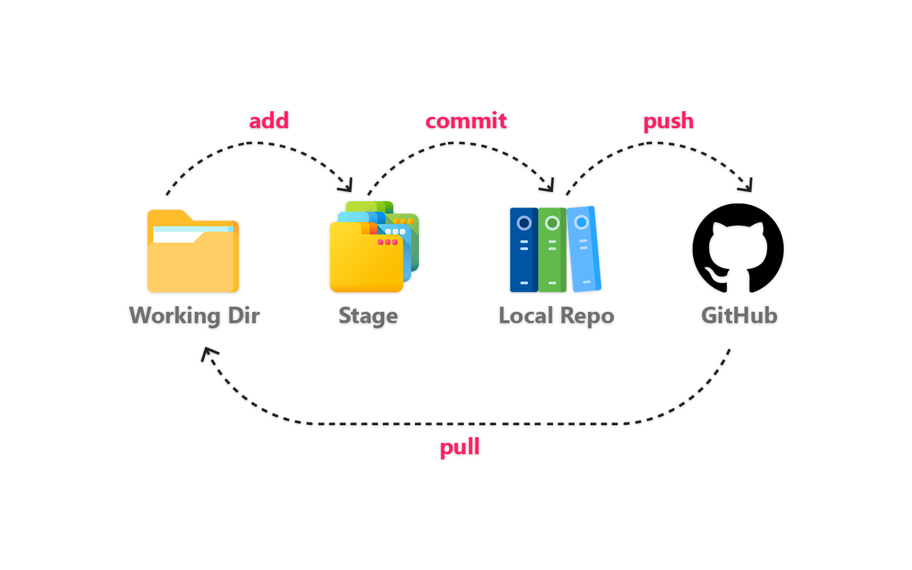

# Git Cheat sheet

This a all in one git cheat sheet. From installation to uploading your project into GitHub all common commands are listed here.

Version control, also known as source control, is the practice of tracking and managing changes to software code. Version control systems are software tools that help software teams manage changes to source code over time.

## Table of Content

1. [Connecting Git and GitHub with SSH](#ssh)
2. [Understanding Git](#git)
3. [Creating local git repository](#local)

<a name="ssh"></a>

### Connecting Git and GitHub with SSH

- Install Git in your local machine.

  To check git version

      git --version

<br>

- Install OpenSSH Client & OpenSSH Server.

  

- Generate SSH key.

```
ssh-keygen
```

- Copy ssh key from C:\Users\Username\\.ssh\id_rsa.pub.
- Paste it into your GitHub account and give it a title.

<br>


<br>
<a name="git"></a>

### Understanding Git

<br>



<br>

### Adding User id and email

    git config --global user.name "Your Name"
    git config --global user.email "youremail@yourdomain.com"

<br>

<a name="local"></a>

### Creating local git repository

<br>

To initialize empty git repository :

    git init

<br>

To initialize empty git repository with branch name:

    git init -b branchName

<br>

To add files for tracking :

    git add .

###### tracked - a file which has been previously staged or committed;

###### untracked - a file which has not been staged or committed; or

<br>

To record the changes :

    git commit -m "message"

<br>

### To see various information

<br>

To see changes and tracking info :

    git status

###### git status lets you see which changes have been staged, which haven't, and which files aren't being tracked by Git.

<br>

To see info of previous commits :

    git log

<br>

To see info of previous commits in one line:

    git log --oneline

###### The Git Log tool allows you to view information about previous commits that have occurred in a project

<br>

To see summary of previous commits (Heads) :

    git reflog

<br>

### Resetting Commits & vice versa


<br>

remove and back to specific commit :

    git reset --hard commitid

###### Never reset after pushing commits

<br>

accidental removed later commits now want them back :

    git reset HEAD@{number}
    git reset --hard

<br>

### Back and forth of commits

<br>

To get back to any previous commit :

    git checkout commitid

<br>

To get back to latest commits :

    git checkout master/main

<br>

### Git push, pull and clone

<br>

Adding remote :

    git remote add origin(any name) url

<br>

Pull from github :

    git pull origin(any name) master(branch name)

<br>

Cloning git repo from web :

    git clone url

###### clone: copying the remote server repository to your local machine.

###### pull: get new changes other have added to your local machine. This is the difference. Clone is generally used to get remote repo copy.

<br>

Uploading into github :

    git push origin(any name) master(branch name)

<br>

### git branch create, switch, merge, delete

<br>

create a new branch :

    git branch branchname

<br>

switching branches :

    git checkout branchname

<br>

merging other branch to current branch :

    git merge (other branch name)

<br>

delete a local branch :

    git branch -d BranchName

<br>

delete a remote branch :

    git push origin(any name) --delete BranchName

<br>

show all remote and local branch :

    git branch -a

<br>

### git ignore file

<br>

Creating .gitignore file :


<br>
